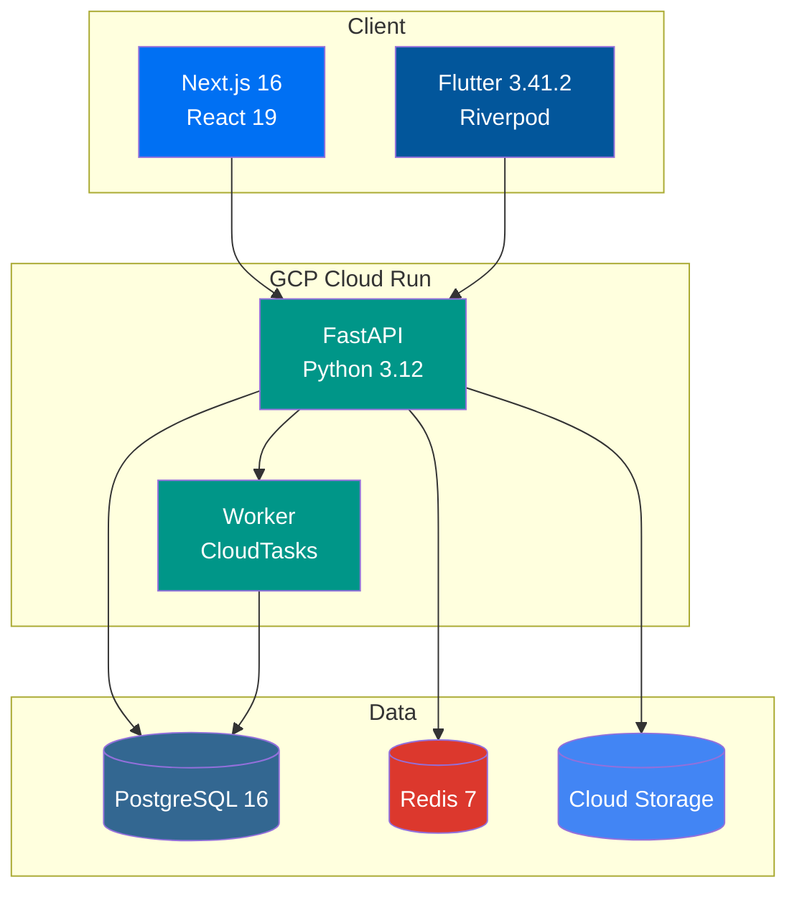
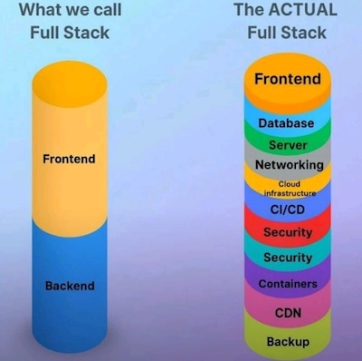
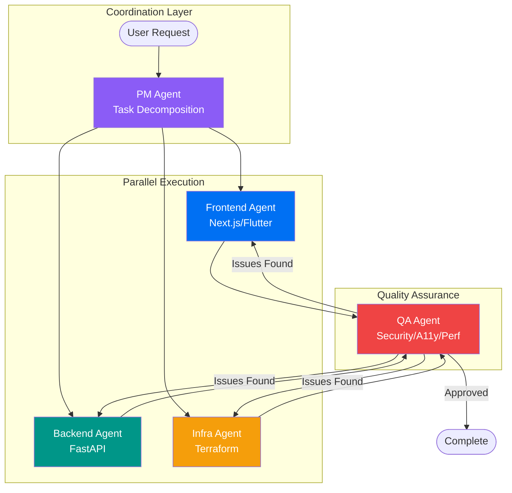

# Fullstack Starter

[](https://github.com/first-fluke/fullstack-starter/stargazers)
[](https://github.com/first-fluke/fullstack-starter)
[](https://github.com/first-fluke/fullstack-starter/releases)
[](https://deepwiki.com/first-fluke/fullstack-starter)

English | [한국어](./README.ko.md)

> Template versioning via [Release Please](https://github.com/googleapis/release-please) — see [CHANGELOG.md](./CHANGELOG.md) for release history.

Production-ready fullstack monorepo template with Next.js 16, FastAPI, Flutter, and GCP infrastructure.

### 3-Tier Architecture



## Key Features

- **Modern Stack**: Next.js 16 + React 19, FastAPI, Flutter 3.41.2, TailwindCSS v4
- **Type Safety**: Full type support with TypeScript, Pydantic, and Dart
- **Authentication**: OAuth with better-auth (Google, GitHub, Facebook)
- **Internationalization**: next-intl (web), Flutter ARB (mobile), shared i18n package
- **Auto-generated API Clients**: Orval (web), swagger_parser (mobile)
- **Infrastructure as Code**: Terraform + GCP (Cloud Run, Cloud SQL, Cloud Storage)
- **CI/CD**: GitHub Actions + Workload Identity Federation (keyless deployment)
- **AI Agent Support**: Guidelines for AI coding agents (Gemini, Claude, etc.)
- **mise Monorepo**: mise-based task management and unified tool versions

## Tech Stack

| Layer | Technology |
|-------|------------|
| **Frontend** | Next.js 16, React 19, TailwindCSS v4, shadcn/ui, TanStack Query, Jotai |
| **Backend** | FastAPI, SQLAlchemy (async), PostgreSQL 16, Redis 7 |
| **Mobile** | Flutter 3.41.2, Riverpod 3, go_router 17, Firebase Crashlytics, Fastlane |
| **Worker** | FastAPI + CloudTasks/PubSub |
| **Infrastructure** | Terraform, GCP (Cloud Run, Cloud SQL, Cloud Storage, CDN) |
| **CI/CD** | GitHub Actions, Workload Identity Federation |
| **Tool Management** | mise (unified Node, Python, Flutter, Terraform versions) |

> **[Why this tech stack?](./docs/WHY.md)** — Detailed reasoning behind each technology choice.



## AI Agent Orchestration

This template includes a multi-agent coordination workflow for complex cross-domain tasks.



| Agent | Role |
|-------|------|
| **PM Agent** | Analyzes requirements, defines API contracts, creates prioritized task breakdown |
| **Domain Agents** | Frontend, Backend, Mobile, Infra agents execute tasks in parallel by priority |
| **QA Agent** | Reviews security (OWASP), performance, accessibility (WCAG 2.1 AA) |

> See [`.agent/workflows/coordinate.md`](.agent/workflows/coordinate.md) for the full orchestration workflow.

## Quick Start

Choose one of the following methods to start with this template:

```bash
# Create from CLI
bun create fullstack-starter my-app
# or
npm create fullstack-starter my-app
```

Or use GitHub:

1. Click **[Use this template](https://github.com/first-fluke/fullstack-starter/generate)** to create a new repository
2. Or **[Fork](https://github.com/first-fluke/fullstack-starter/fork)** this repository

### Prerequisites

**Required for all platforms:**
- [mise](https://mise.jdx.dev/) - Runtime version manager
- [Docker](https://www.docker.com/) or [Podman Desktop](https://podman-desktop.io/downloads) - Local infrastructure

**For mobile development (iOS/Android):**
- [Xcode](https://apps.apple.com/app/xcode/id497799835) - Includes iOS Simulator (macOS only)
- [Android Studio](https://developer.android.com/studio) - Includes Android SDK and emulator

**Optional:**
- [Terraform](https://www.terraform.io/) - Cloud infrastructure

### 1. Install Runtimes

```bash
# Install mise (if not installed)
curl https://mise.run | sh

# Install all runtimes (Node 24, Python 3.12, Flutter 3, bun, uv, Terraform)
mise install
```

### 2. Install Dependencies

```bash
# Install all dependencies at once
mise run install
```

### 3. Start Local Infrastructure

```bash
mise infra:up
```

This starts:
- PostgreSQL (5432)
- Redis (6379)
- MinIO (9000, 9001)

### 4. Run Database Migrations

```bash
mise db:migrate
```

### 5. Start Development Servers

```bash
# Start API and Web services (recommended for web development)
mise dev:web

# Start API and Mobile services (recommended for mobile development)
mise dev:mobile

# Or start all services
mise dev
```

## Project Structure

```
fullstack-starter/
├── apps/
│   ├── api/           # FastAPI backend
│   ├── web/           # Next.js frontend
│   ├── worker/        # Background worker
│   ├── mobile/        # Flutter mobile app
│   └── infra/         # Terraform infrastructure
├── packages/
│   ├── design-tokens/ # Shared design tokens (Source of Truth)
│   └── i18n/          # Shared i18n package (Source of Truth)
├── .agent/rules/      # AI agent guidelines
├── .serena/           # Serena MCP config
└── .github/workflows/ # CI/CD
```

## Commands

### mise Monorepo Tasks

This project uses mise monorepo mode with `//path:task` syntax.

```bash
# List all available tasks
mise tasks --all
```

| Command | Description |
|---------|-------------|
| `mise db:migrate` | Run database migrations |
| `mise dev` | Start all services |
| `mise dev:web` | Start API and Web services |
| `mise dev:mobile` | Start API and Mobile services |
| `mise format` | Format all apps |
| `mise gen:api` | Generate OpenAPI schema and API clients |
| `mise i18n:build` | Build i18n files |
| `mise infra:down` | Stop local infrastructure |
| `mise infra:up` | Start local infrastructure |
| `mise lint` | Lint all apps |
| `mise run install` | Install all dependencies |
| `mise test` | Test all apps |
| `mise tokens:build` | Build design tokens |
| `mise typecheck` | Type check |

### App-specific Tasks

<details>
<summary>API (apps/api)</summary>

| Command | Description |
|---------|-------------|
| `mise //apps/api:install` | Install dependencies |
| `mise //apps/api:dev` | Start development server |
| `mise //apps/api:test` | Run tests |
| `mise //apps/api:lint` | Run linter |
| `mise //apps/api:format` | Format code |
| `mise //apps/api:typecheck` | Type check |
| `mise //apps/api:migrate` | Run migrations |
| `mise //apps/api:migrate:create` | Create new migration |
| `mise //apps/api:gen:openapi` | Generate OpenAPI schema |
| `mise //apps/api:infra:up` | Start local infrastructure |
| `mise //apps/api:infra:down` | Stop local infrastructure |

</details>

<details>
<summary>Web (apps/web)</summary>

| Command | Description |
|---------|-------------|
| `mise //apps/web:install` | Install dependencies |
| `mise //apps/web:dev` | Start development server |
| `mise //apps/web:build` | Production build |
| `mise //apps/web:test` | Run tests |
| `mise //apps/web:lint` | Run linter |
| `mise //apps/web:format` | Format code |
| `mise //apps/web:typecheck` | Type check |
| `mise //apps/web:gen:api` | Generate API client |

</details>

<details>
<summary>Mobile (apps/mobile)</summary>

| Command | Description |
|---------|-------------|
| `mise //apps/mobile:install` | Install dependencies |
| `mise //apps/mobile:dev` | Run on device/simulator |
| `mise //apps/mobile:build` | Build |
| `mise //apps/mobile:test` | Run tests |
| `mise //apps/mobile:lint` | Run analyzer |
| `mise //apps/mobile:format` | Format code |
| `mise //apps/mobile:gen:l10n` | Generate localizations |
| `mise //apps/mobile:gen:api` | Generate API client |

</details>

<details>
<summary>Worker (apps/worker)</summary>

| Command | Description |
|---------|-------------|
| `mise //apps/worker:install` | Install dependencies |
| `mise //apps/worker:dev` | Start worker |
| `mise //apps/worker:test` | Run tests |
| `mise //apps/worker:lint` | Run linter |
| `mise //apps/worker:format` | Format code |

</details>

<details>
<summary>Infrastructure (apps/infra)</summary>

| Command | Description |
|---------|-------------|
| `mise //apps/infra:init` | Initialize Terraform |
| `mise //apps/infra:plan` | Preview changes |
| `mise //apps/infra:apply` | Apply changes |
| `mise //apps/infra:plan:prod` | Preview production |
| `mise //apps/infra:apply:prod` | Apply production |

</details>

<details>
<summary>i18n (packages/i18n)</summary>

| Command | Description |
|---------|-------------|
| `mise //packages/i18n:install` | Install dependencies |
| `mise //packages/i18n:build` | Build i18n files for web and mobile |
| `mise //packages/i18n:build:web` | Build for web only |
| `mise //packages/i18n:build:mobile` | Build for mobile only |

</details>

<details>
<summary>Design Tokens (packages/design-tokens)</summary>

| Command | Description |
|---------|-------------|
| `mise //packages/design-tokens:install` | Install dependencies |
| `mise //packages/design-tokens:build` | Build tokens for web and mobile |
| `mise //packages/design-tokens:dev` | Watch mode for development |
| `mise //packages/design-tokens:test` | Run tests |

</details>

## Internationalization (i18n)

`packages/i18n` is the Single Source of Truth for i18n resources.

```bash
# Edit i18n files
packages/i18n/src/en.arb  # English (default)
packages/i18n/src/ko.arb  # Korean
packages/i18n/src/ja.arb  # Japanese

# Build and deploy to each app
mise i18n:build
# Generated files:
# - apps/web/src/config/messages/*.json (Nested JSON)
# - apps/mobile/lib/i18n/messages/app_*.arb (Flutter ARB)
```

## Design Tokens

`packages/design-tokens` is the Single Source of Truth for design tokens (colors, spacing, etc.).

```bash
# Edit tokens
packages/design-tokens/src/tokens.ts

# Build and distribute
mise tokens:build
# Generated files:
# - apps/web/src/app/[locale]/tokens.css (CSS variables)
# - apps/mobile/lib/core/theme/generated_theme.dart (Flutter Theme)
```

## Configuration

### Environment Variables

Copy example files and configure:

```bash
# API
cp apps/api/.env.example apps/api/.env

# Web
cp apps/web/.env.example apps/web/.env

# Infra
cp apps/infra/terraform.tfvars.example apps/infra/terraform.tfvars
```

### GitHub Actions Secrets

Set these secrets in your repository:

| Secret | Description |
|--------|-------------|
| `GCP_PROJECT_ID` | GCP project ID |
| `GCP_REGION` | GCP region (e.g., `asia-northeast3`) |
| `WORKLOAD_IDENTITY_PROVIDER` | From Terraform output |
| `GCP_SERVICE_ACCOUNT` | From Terraform output |
| `FIREBASE_SERVICE_ACCOUNT_JSON` | Firebase service account JSON (for mobile deployment) |
| `FIREBASE_ANDROID_APP_ID` | Firebase Android app ID |

### Firebase (Mobile)

1. Install FlutterFire CLI:

```bash
dart pub global activate flutterfire_cli
```

2. Configure Firebase for your project:

```bash
cd apps/mobile
flutterfire configure
```

This generates `lib/firebase_options.dart` with your Firebase configuration.

## Deployment

### GitHub Actions (Recommended)

Push to `main` branch triggers automatic deployment:
- `apps/api/` changes → Deploy API
- `apps/web/` changes → Deploy Web
- `apps/worker/` changes → Deploy Worker
- `apps/mobile/` changes → Build & Deploy to Firebase App Distribution

### Manual Deployment

```bash
# Build and push Docker images
cd apps/api
docker build -t gcr.io/PROJECT_ID/api .
docker push gcr.io/PROJECT_ID/api

# Deploy to Cloud Run
gcloud run deploy api --image gcr.io/PROJECT_ID/api --region REGION
```

### Mobile (Fastlane)

The mobile app uses Fastlane for build automation and deployment.

```bash
cd apps/mobile

# Install Ruby dependencies
bundle install

# Available lanes
bundle exec fastlane android build       # Build APK
bundle exec fastlane android firebase    # Deploy to Firebase App Distribution
bundle exec fastlane android internal    # Deploy to Play Store (internal)
bundle exec fastlane ios build           # Build iOS (no codesign)
bundle exec fastlane ios testflight_deploy  # Deploy to TestFlight
```

## AI Agent Support

This template is designed to work with AI coding agents (Gemini, Claude, etc.).

- `.agent/rules/` - Guidelines for AI agents
- `.serena/` - Serena MCP configuration

## Documentation

- [Build Guide](.agent/rules/build-guide.md)
- [Lint & Format Guide](.agent/rules/lint-format-guide.md)
- [Test Guide](.agent/rules/test-guide.md)

## License

MIT

## Sponsors

If this project helped you, please consider buying me a coffee!

<a href="https://www.buymeacoffee.com/firstfluke" target="_blank"></a>

Or leave a star:

```bash
gh api --method PUT /user/starred/first-fluke/fullstack-starter
```

## Star History

[](https://www.star-history.com/#first-fluke/fullstack-starter&type=date&legend=bottom-right)
